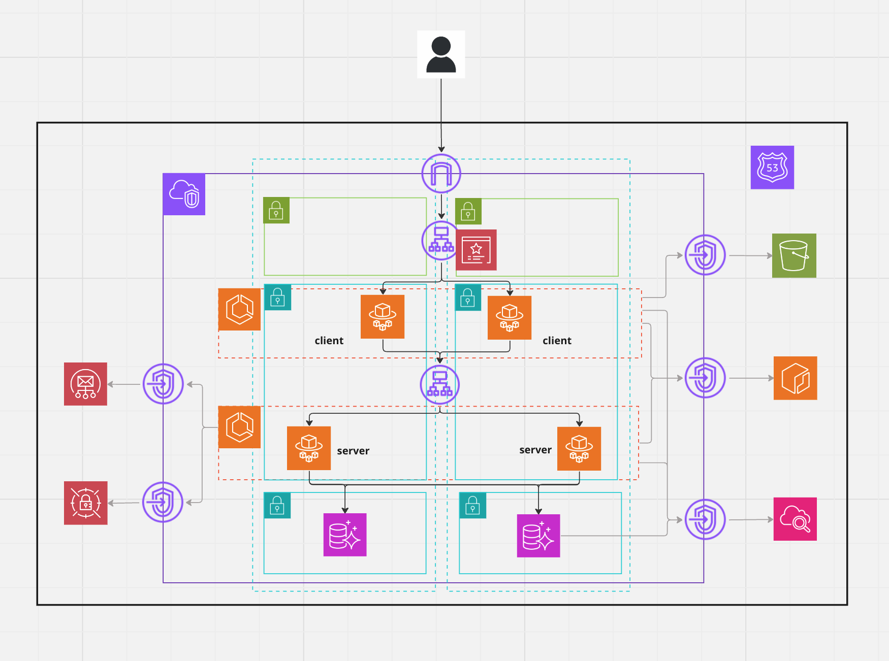
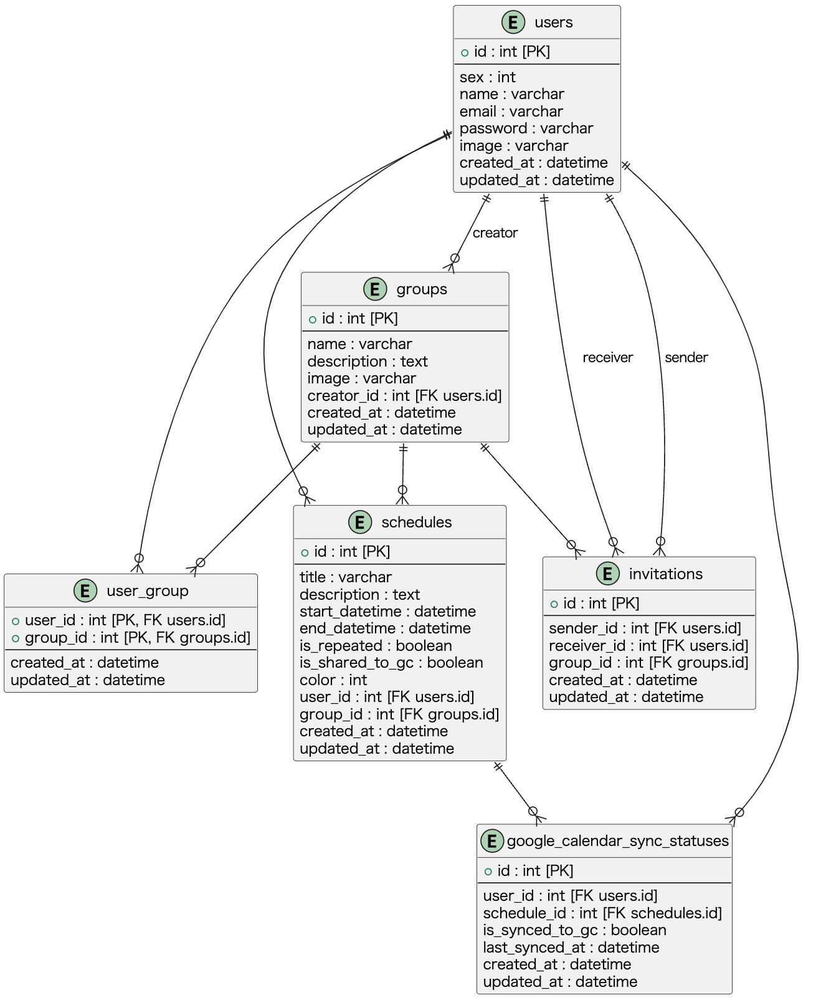

## What is

Calendar

## infra configuration

<div style="display: flex; justify-content: center; align-items: center; width: 80%; margin: 0 auto;">
    
</div>

## ER diagram

<div style="display: flex; justify-content: center; align-items: center; width: 80%; margin: 0 auto;">
    
</div>

## DB configuration

1. **users テーブル**

| Column     | Type     | Constraints        | Description                               |
| ---------- | -------- | ------------------ | ----------------------------------------- |
| id         | int      | PK, Auto Increment | ユーザーの一意な ID                       |
| sex        | int      | Not Null           | ユーザーの性別（0: male、1: female など） |
| name       | varchar  | Not Null, Unique   | ユーザーの名前                            |
| email      | varchar  | Not Null, Unique   | ユーザーの E メールアドレス               |
| password   | varchar  | Not Null           | ユーザーのパスワード                      |
| image      | varchar  |                    | ユーザーの画像の URL またはパス           |
| created_at | datetime |                    | レコードが作成された日時                  |
| updated_at | datetime |                    | レコードが最後に更新された日時            |

2. **groups テーブル**

| Column      | Type     | Constraints        | Description                     |
| ----------- | -------- | ------------------ | ------------------------------- |
| id          | int      | PK, Auto Increment | グループの一意な ID             |
| name        | varchar  | Not Null           | グループの名前                  |
| description | text     |                    | グループの説明                  |
| image       | varchar  |                    | グループの画像の URL            |
| creator_id  | int      | FK, Not Null       | グループを作成したユーザーの ID |
| created_at  | datetime |                    | レコードが作成された日時        |
| updated_at  | datetime |                    | レコードが最後に更新された日時  |

3. **user_group テーブル**

| Column     | Type     | Constraints      | Description                    |
| ---------- | -------- | ---------------- | ------------------------------ |
| user_id    | int      | PK, FK, Not Null | ユーザーの一意な ID            |
| group_id   | int      | PK, FK, Not Null | グループの一意な ID            |
| created_at | datetime |                  | レコードが作成された日時       |
| updated_at | datetime |                  | レコードが最後に更新された日時 |

4. **schedules テーブル**

| Column          | Type     | Constraints        | Description                                              |
| --------------- | -------- | ------------------ | -------------------------------------------------------- |
| id              | int      | PK, Auto Increment | スケジュールの一意な ID                                  |
| title           | varchar  | Not Null           | スケジュールのタイトル                                   |
| description     | text     |                    | スケジュールの説明                                       |
| start_datetime  | datetime | Not Null           | スケジュールの開始日時                                   |
| end_datetime    | datetime | Not Null           | スケジュールの終了日時                                   |
| is_repeated     | boolean  | Not Null           | スケジュールが定期的かどうか                             |
| is_shared_to_gc | boolean  | Not Null           | スケジュールが Google Calendar に共有されたか            |
| color           | int      | Not Null           | スケジュールを表示する色のコード（0: red、1: blue など） |
| user_id         | int      | FK, Not Null       | スケジュールを作成したユーザー ID                        |
| group_id        | int      | FK, Not Null       | スケジュールが作成されたグループ ID                      |
| created_at      | datetime |                    | レコードが作成された日時                                 |
| updated_at      | datetime |                    | レコードが最後に更新された日時                           |

5. **google_calendar_sync_statuses テーブル**

| Column          | Type     | Constraints        | Description                                              |
| --------------- | -------- | ------------------ | -------------------------------------------------------- |
| id              | int      | PK, Auto Increment | 同期状態の一意な ID                                      |
| user_id         | int      | FK, Not Null       | ユーザー ID                                              |
| schedule_id     | int      | FK, Not Null       | スケジュール ID                                          |
| is_synced_to_gc | boolean  | Not Null           | スケジュールが Google カレンダーと同期されているかどうか |
| last_synced_at  | datetime |                    | 最後に同期した日時                                       |
| created_at      | datetime |                    | レコードが作成された日時                                 |
| updated_at      | datetime |                    | レコードが最後に更新された日時                           |

6. **invitations テーブル**

| Column      | Type     | Constraints        | Description                    |
| ----------- | -------- | ------------------ | ------------------------------ |
| id          | int      | PK, Auto Increment | 招待の一意な ID                |
| sender_id   | int      | FK, Not Null       | 招待を送ったユーザー ID        |
| receiver_id | int      | FK, Not Null       | 招待を受けたユーザー ID        |
| group_id    | int      | FK, Not Null       | 招待が関連するグループ ID      |
| created_at  | datetime |                    | レコードが作成された日時       |
| updated_at  | datetime |                    | レコードが最後に更新された日時 |

## How to start Go http server

1. Run docker container

```
$ docker compose up -d --build
```

## How to set up infra

1. Create symbolic link

```
(~/infra/aws/environments/stg) ln -s provider.tf ../../provider.tf
```

2. Create S3 bucket for terraform backend

```
aws s3api create-bucket --bucket sharely-terraform-state-bucket --region ap-northeast-1 --create-bucket-configuration LocationConstraint=ap-northeast-1
```

3. Create Dynamo DB for terraform backend rock

```
aws dynamodb create-table --table-name sharely-terraform-up-and-running-locks \
  --attribute-definitions AttributeName=LockID,AttributeType=S \
  --key-schema AttributeName=LockID,KeyType=HASH \
  --provisioned-throughput ReadCapacityUnits=5,WriteCapacityUnits=5 \
  --region ap-northeast-1
```

4. Terraform init

```
(~/infra/aws/environments/stg) terraform init
```

5. Encrypt s3 bucket

```
aws s3api put-bucket-encryption --bucket sharely-terraform-state-bucket --server-side-encryption-configuration '{"Rules": [{"ApplyServerSideEncryptionByDefault": {"SSEAlgorithm": "AES256"}}]}'
```

6. Set Versioning to s3 bucket

```
aws s3api put-bucket-versioning --bucket sharely-terraform-state-bucket --versioning-configuration Status=Enabled
```

## Supplement

### infra

- Format tf file

```
terraform fmt
```

- Validate tf file

```
terraform validate
```

- Create Terraform document

```
terraform-docs markdown table --output-file README.md .
```

- Check what will be created

```
terraform plan
```

- Create resource

```
AWS_PROFILE=sharely terraform apply
```

- Delete resource

```
AWS_PROFILE=sharely terraform destroy
```
